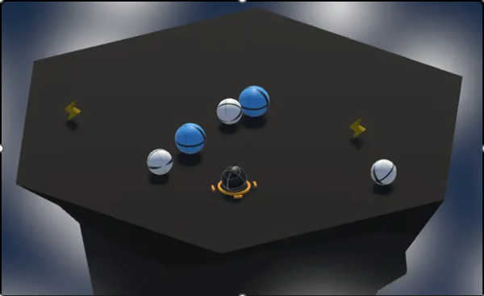

# Ball Buster

Welcome to **Ball Buster**, an intense action-packed game where you face waves of enemy balls on a challenging round platform. Your goal is to survive each wave by avoiding falls and collisions, while knocking enemies off the edge. Power up your collision strength to deliver harder hits and dominate the arena.

---

## 🌐 Play Online

Play the game online here: [Ball Buster on Unity Play](https://play.unity.com/en/games/8f44a0d0-37c2-442f-8e4e-3cf2a3f0037e/ball-buster)

---

## 🎮 Game Features

- **Intense Survival Gameplay**: Avoid falling off the platform and knocking into enemy balls.
- **Collision Strength Power-Up**: Collect power-ups to increase your strength and deal harder hits.
- **Waves of Enemies**: Survive wave after wave of enemies, with each wave becoming more challenging.
- **Simple Controls**: Easy-to-master controls for fast-paced, action-packed fun.

---

## 🕹️ Controls

- **Movement**:
  - Move Forward: W or Up Arrow
  - Move Backward: S or Down Arrow
- **Camera Rotation**:
  - Rotate Left: A or Left Arrow
  - Rotate Right: D or Right Arrow

---

## 📖 How to Play

1. **Survival**: Avoid falling off the platform and colliding with enemy balls.
2. **Attack**: Hit enemy balls to knock them off the platform.
3. **Power Up**: Collect power-ups to increase your collision strength for more effective attacks.
4. **Waves**: Survive as many waves as possible, with each wave becoming progressively harder.
