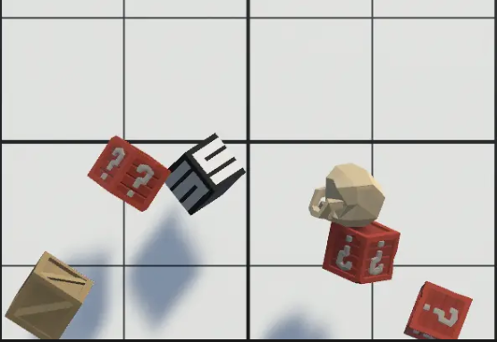

# Clicky Ninja

Welcome to **Clicky Ninja**, an exciting game where you test your reflexes and skill by navigating through various challenges. Choose from three difficulty modes: Easy, Medium, and Hard, and see how far you can go. Your goal is to pick up boxes and avoid skulls while keeping your three lives intact and increasing your score.

---

## 🌐 Play Online

Play the game online here: [Clicky Ninja on Unity Play](https://play.unity.com/en/games/fc3c93a4-2622-4985-9c1b-127ec24afc4f/clicky-ninja)

---

## 🎮 Game Features

- **Multiple Difficulty Modes**: Select from Easy, Medium, or Hard to adjust the challenge level.
- **Quick Reflex Gameplay**: Test your reflexes as you pick up boxes and dodge skulls.
- **Lives Management**: You start with three lives. Avoid skulls to keep your lives intact.
- **Simple and Engaging Controls**: Easy-to-learn mechanics make the game accessible to all players.

---

## 🕹️ Controls

- **Interact**: Left Click Mouse to pick up boxes.
- **Pause**: Tab to pause the game.

---

## 📖 How to Play

1. **Choose Difficulty**: Select from Easy, Medium, or Hard mode to match your skill level.
2. **Pick Up Boxes**: Click on boxes to collect them and increase your score.
3. **Avoid Skulls**: Stay clear of skulls to preserve your lives. You have 3 lives, so be careful!
4. **Increase Your Score**: Collect more boxes and survive longer to increase your score. Can you get the highest score?
