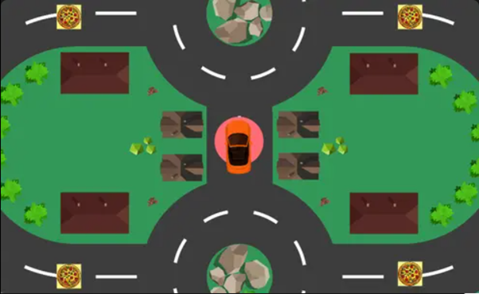

# Delivery Driver

Welcome to **Delivery Driver**, where you race against the clock to deliver pizzas to hungry customers. Your goal is to successfully deliver all pizzas within the time limit to win. With only 120 seconds to complete the challenge, you'll need sharp reflexes and precise driving skills.

---

## 🌐 Play Online

Play the game online here: [Delivery Driver on Unity Play](https://play.unity.com/en/games/74287c78-b4c9-4742-b61a-434e59d58a18/delivery-driver)

---

## 🎮 Game Features

- **Time-Based Challenge**: You have 120 seconds to deliver all pizzas. Manage your time wisely!
- **Speed Boosts**: Look for boost pads on the map to speed up deliveries.
- **Precise Driving Skills**: Use sharp reflexes to navigate through the city and avoid obstacles.
- **Simple Controls**: Easy-to-learn controls to quickly jump into the action.

---

## 🕹️ Controls

- **Movement**: Use your Arrow keys or W A S D to drive the car.

---

## 📖 How to Play

1. **Deliver Pizzas**: Navigate your car to deliver pizzas to the red markers representing customers.
2. **Time Limit**: You have 120 seconds to deliver all pizzas. Manage your time wisely to ensure timely deliveries.
3. **Boost**: Look out for boost pads on the map to speed up your delivery. Use the boost to get ahead, but be careful—colliding with objects will cause you to lose your boost.
4. **Win or Lose**: Successfully deliver all pizzas within the time limit to win the game. Fail to do so, and you'll have to try again!
