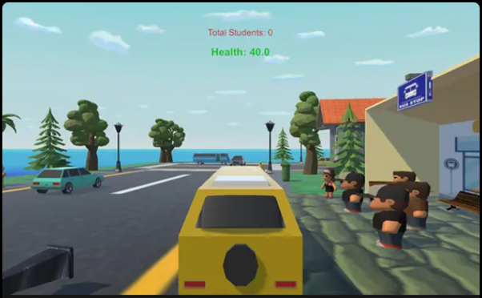

# School Bus Simulator

Take on the role of a school bus driver in **School Bus Simulator**, a game where your mission is to safely pick up students and deliver them to school. Can you complete the route without any collisions?

---

## 🌐 Play Online

Play the game online here: [School Bus Simulator on Unity Play](https://play.unity.com/en/games/be0b9799-9c8b-4d6c-9b8e-18943a887e66/bus-simulator)

---

## 🎮 Game Features

- **Mission-Based Gameplay**: Pick up students from three bus stops and deliver them to school.
- **Realistic Driving Mechanics**: Navigate through a lively environment with smooth driving controls.
- **Collision Awareness**: Avoid obstacles and other vehicles to ensure a safe journey.
- **Simple Controls**: Easy-to-master controls for an enjoyable experience.

---

## 🕹️ Controls

- **Movement**: Use `Arrow Keys` or `W A S D` to drive the bus.
- **Stop & Pick Up**: Press `Space` to stop the bus and pick up students.

---

## 📖 How to Play

1. **Start the Game**: Begin your journey as a school bus driver.
2. **Pick Up Students**: Locate bus stops and stop the bus at each station (floor). Press `Space` to pick up the children waiting at each stop.
3. **Complete the Route**: Successfully pick up all students from the three bus stops and deliver them to school to win the game.
4. **Avoid Collisions**: Drive carefully and avoid obstacles and other vehicles along the way.
