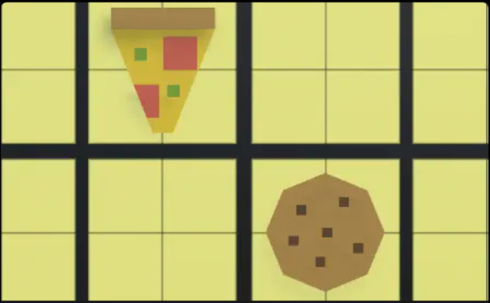

# Snack Smasher

Welcome to **Snack Smasher**, an exciting and fun-filled game where your reflexes and focus are the key to success! Click on snacks to score points while avoiding skulls that appear in random boxes. Can you beat the clock and set a high score?

---

## 🌐 Play Online

Play the game online here: [Snack Smasher on Unity Play](https://play.unity.com/en/games/08033134-68ce-407b-b120-0d93870881dd/snack-smasher)

---

## 🎮 Game Features

- **Three Difficulty Levels**: Choose from Easy, Medium, or Hard to match your skill level.
- **Quick Reflex Challenge**: Snacks and skulls appear randomly in boxes, so stay sharp!
- **Time-Limited Gameplay**: You have 60 seconds to score as many points as possible.
- **Simple Controls**: Play with just your mouse for an intuitive experience.

---

## 🕹️ Controls

- **Interact**: Left-click mouse to collect snacks.
- **Pause**: Press the Tab key to pause the game.

---

## 📖 How to Play

1. **Choose Difficulty**: Select Easy, Medium, or Hard mode on the main menu.
2. **Collect Snacks**: Click on the snacks that appear in the boxes to collect points.
3. **Avoid Skulls**: Watch out for skulls! Clicking on them will hinder your progress.
4. **Time Limit**: Score as high as possible within the 60-second time frame.

