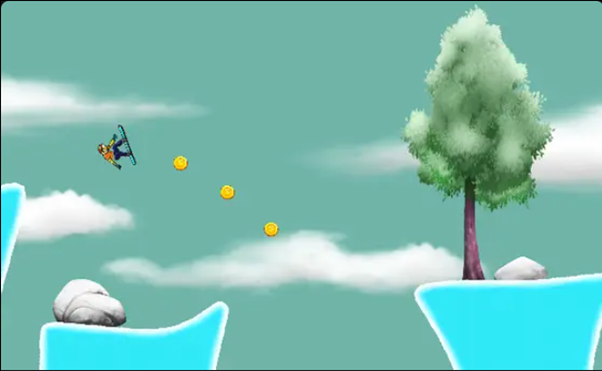

# Snow Boarder

Welcome to **Snow Boarder**, a thrilling snowboarding game where you glide down icy slopes, collect coins, and perform daring jumps. Your goal is to collect as many coins as possible while avoiding crashes to achieve the highest score. With challenging obstacles and exciting gameplay, you’ll need to master your snowboarding skills to win!

---

## 🌐 Play Online

Play the game online here: [Snow Boarder on Unity Play](https://play.unity.com/en/games/488cdc7b-7bcb-4c8d-ae7d-da4fe2f0567b/snow-boarder)

---

## 🎮 Game Features

- **Thrilling Snowboarding Gameplay**: Glide down icy slopes, dodge obstacles, and collect coins.
- **Challenging Obstacles**: Avoid crashes while performing daring moves to stay on course.
- **Speed & Rotation Controls**: Use speed and rotation to master your snowboarding tricks.
- **High Score Challenge**: Collect more coins to score higher and compete for the best run.

---

## 🕹️ Controls

- **Increase Speed**: W or Up Arrow Key
- **Rotate Left/Right**: A and D or Left and Right Arrow Keys

---

## 📖 How to Play

1. **Collect Coins**: Navigate your snowboarder to collect coins scattered along the icy path to increase your score.
2. **Avoid Crashes**: Watch out for obstacles and jump at the right time to avoid crashing. Keep your reflexes sharp to stay on course!
3. **Speed and Rotation**: Use the W key or Up Arrow to speed up and the A, D, or Left and Right Arrow keys to rotate your character for better maneuvering.
4. **Score**: The more coins you collect without crashing, the higher your score. Aim for a perfect run to achieve the best score possible!
