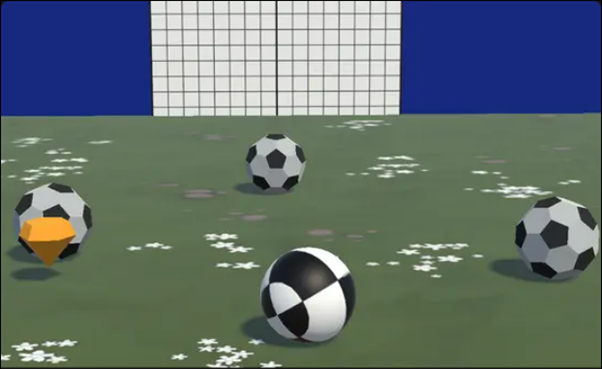

# Soccer Buster

Welcome to **Soccer Buster**, a thrilling game where you defend your goal against waves of enemy balls. Your mission is to prevent the enemy balls from scoring in your goal. If an enemy ball hits your goal 5 times, the game is over. Hit the enemy balls towards their goal to destroy them and increase your score. Strategically use your power-ups to boost your collision strength and dominate the field.

---

## 🌐 Play Online

Play the game online here: [Soccer Buster on Unity Play](https://play.unity.com/en/games/7e1a80b9-98dc-43a6-801e-701a1508a179/goal-buster)

---

## 🎮 Game Features

- **Defend Your Goal**: Prevent enemy balls from hitting your goal. If they score 5 times, the game ends.
- **Attack**: Hit enemy balls towards their goal to destroy them and earn points.
- **Power-Up System**: Collect power-ups to increase your collision strength and boost your performance.
- **Challenging Waves**: Face increasingly difficult waves of enemy balls as you progress.

---

## 🕹️ Controls

- **Movement**:
  - Move Forward: W or Up Arrow
  - Move Backward: S or Down Arrow
- **Rotation**:
  - Rotate Left: A or Left Arrow
  - Rotate Right: D or Right Arrow
- **Boost**: Press Space to boost your speed.

---

## 📖 How to Play

1. **Defend Your Goal**: Prevent enemy balls from hitting your goal. If they score 5 times, the game ends.
2. **Attack**: Hit enemy balls towards their goal to destroy them and earn points.
3. **Power Up**: Collect power-ups to increase your collision strength and boost your performance.
4. **Waves**: Face increasingly challenging waves of enemy balls. Survive as long as possible!
